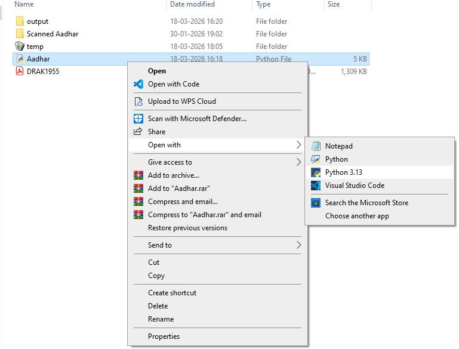
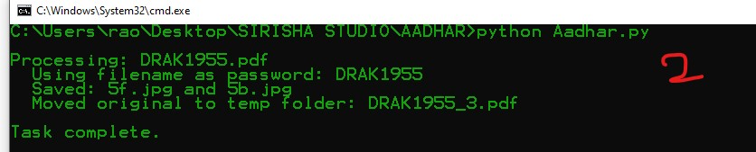
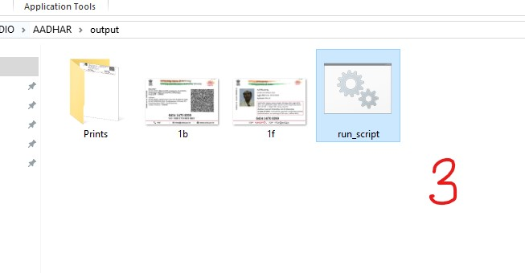

# 🪪 Aadhar Card Processor

A Python automation tool to extract **front and back images** from Aadhar card PDFs or images using high-resolution processing and fixed cropping coordinates.

---

## 📌 Overview

This script is built for **bulk Aadhar processing workflows**. It converts PDFs into high-quality images, extracts both sides of the card using precise coordinates, and organizes outputs automatically.

---

## ✨ Features

* 📄 Supports **PDF and image inputs** (`.pdf`, `.jpg`, `.jpeg`)
* 🔐 Handles **password-protected PDFs**
* 🧠 Smart password logic:

  * If filename has **8 characters → used as password**
  * Otherwise → prompts user input
* 🖼️ Converts PDF → image at **700 DPI**
* ✂️ Extracts **front & back** using fixed coordinates
* 🧾 Saves images in **high-quality JPG (95%)**
* 🔢 Auto numbering system (`1f.jpg`, `1b.jpg`, etc.)
* 📦 Moves processed files safely to `temp/`
* ♻️ Avoids filename conflicts in temp folder

---

## 📸 Preview





---

## 📁 Folder Structure

```
AADHAR/
│── Aadhar.py
│── output/
│── temp/
```

---

## 📥 Input

Place files in the same folder as script:

* `.pdf` (password or non-password)
* `.jpg`, `.jpeg`

---

## 📤 Output

* `output/`

  * `1f.jpg` → Front side
  * `1b.jpg` → Back side
* `temp/`

  * Original files (renamed if duplicate)

---

## ▶️ Usage

```bash
python Aadhar.py
```

---

## ⚙️ How It Works

1. Scans folder for valid files
2. For PDF:

   * Detects password
   * Converts first page → image (700 DPI)
3. Loads image using OpenCV
4. Crops using fixed coordinates:

   * Front → `[5565:7128, 478:2928]`
   * Back → `[5570:7128, 3031:5476]`
5. Saves outputs with incremental naming
6. Moves original file → `temp/` safely
7. Deletes temporary converted images

---

## ⚠️ Important Notes

* Update `POPPLER_PATH` before running:

  ```python
  POPPLER_PATH = "your_poppler_bin_path"
  ```
* Requires:

  * `opencv-python`
  * `pdf2image`
  * `numpy`
* Cropping works only if input format is **consistent**
* High DPI (700) ensures accuracy but may use more memory

---

## 🚀 Advantages

* ⚡ Fast batch processing
* 🎯 High accuracy for standard Aadhar layout
* 🧩 Fully automated workflow
* 🔁 No manual cropping needed
* 🛡️ Safe file handling (no overwrite issues)

---

## ❗ Limitations

* ❌ Works only for specific scan layout
* ❌ Hardcoded crop coordinates
* ❌ Needs Poppler installed
* ❌ Not suitable for rotated/skewed inputs

---

## 💡 Use Cases

* Document centers / studios
* Bulk Aadhar digitization
* Automation pipelines
* ID card processing systems

---

## 👤 Author

GitHub: https://github.com/Ashu-0143
