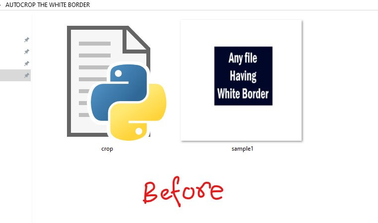
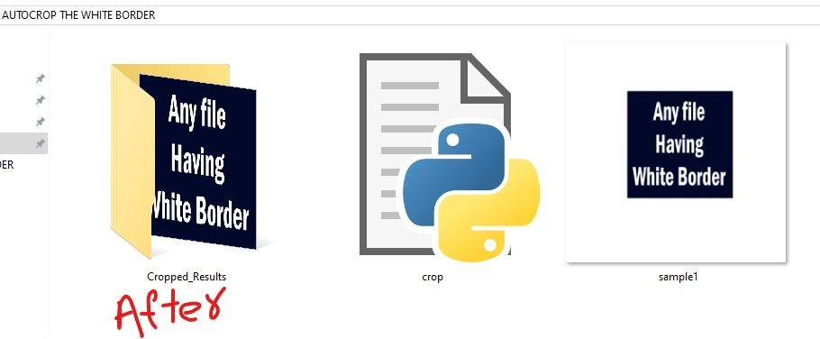

# ✂️ Auto Crop White Border

---

## 📌 Overview
This script:
- Removes **white borders automatically**
- Works on **Images + PDFs**
- Saves cropped results in a separate folder

---

## 📂 Folder Structure
```
AUTOCROP THE WHITE BORDER/
│   crop.py
│
└───Cropped_Results
    │   cropped_sample1.jpg
```

---

## 🖼️ Sample Output
  


---

## ⚙️ Requirements
```bash
pip install pillow pdf2image
```

Install **Poppler** and set path:
```python
POPPLER = r"C:\path\to\poppler\bin"
```

---

## 🚀 How To Use
1. Place files in the folder:
   - Images → `.jpg`, `.png`, `.jpeg`, `.webp`
   - PDFs → `.pdf`

2. Run:
```bash
python crop.py
```

3. Output:
- Cropped files saved in:
```
Cropped_Results/
```

---

## 🧠 Key Logic

### 🖼️ Image Cropping
```python
bg = Image.new('RGB', img.size, (255, 255, 255))
diff = ImageChops.difference(img, bg)
bbox = diff.getbbox()
```
- Compares image with white background
- Detects non-white area
- Crops automatically

---

### 📄 PDF Cropping
- Converts PDF → images (300 DPI)
- Crops each page
- Saves as **multi-page PDF**

---

## ⚡ Features
- ✔️ Works for both images & PDFs
- ✔️ Auto-detects white borders
- ✔️ Batch processing
- ✔️ Keeps original files untouched
- ✔️ Clean output naming (`cropped_*`)

---

## ⚠️ Limitations
- Works best for **pure white borders**
- May not crop correctly if:
  - Background is not white
  - Borders are very thin

---

## 💡 Tip
For better results:
- Use clear white background scans
- Increase contrast before cropping if needed

---

## 🧾 Output Naming
- `cropped_filename.jpg`
- `cropped_filename.pdf`

---
