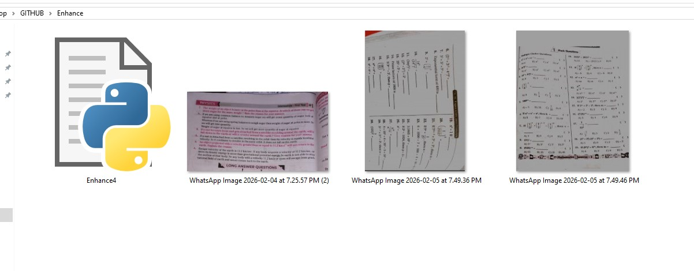
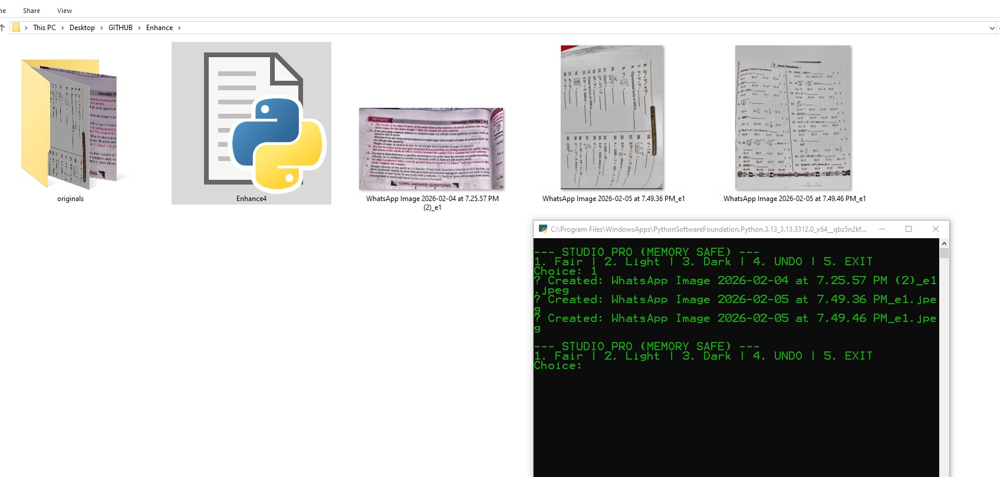
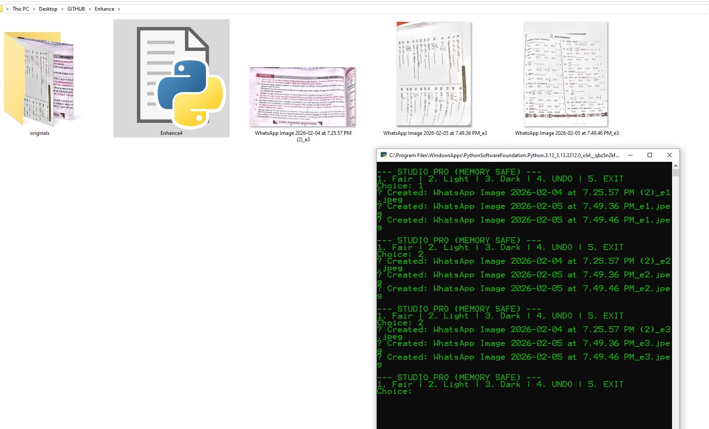
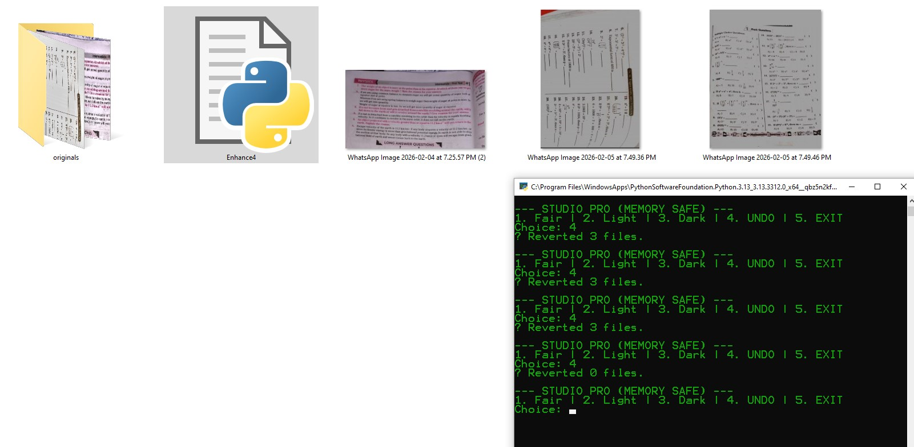

# 🎨 Image Enhance Studio (Pro)

---

## 📌 Overview
This tool:
- Enhances images using **Fair / Light / Dark modes**
- Supports **Images + PDFs**
- Maintains **version history (_e1, _e2...)**
- Allows **undo to previous state**

---

## 📂 Folder Structure
```
Enhance/
│   Enhance4.py
│
└───originals
    (auto-created backup files)
```

---

## 🖼️ Workflow Examples

### 🔹 Step 1 – Raw Images


---

### 🔹 Step 2 – Fair Enhancement


- Executed script → `originals/` folder created  
- Skin tone becomes **balanced & fair**

---

### 🔹 Step 3 – Light Mode (Applied Twice)


- Applied **Light (2) twice**
- Result:
  - Brighter image
  - Better visibility
  - Suitable for printing

---

### 🔹 Step 4 – Undo (Back to Original)


- Used **UNDO option**
- All images restored back to original (e0)

---

## ⚙️ Requirements
```bash
pip install opencv-python numpy pillow pillow-heif pymupdf
```

---

## 🚀 How To Use
Run:
```bash
python Enhance4.py
```

Menu:
```
1. Fair
2. Light
3. Dark
4. UNDO
5. EXIT
```

---

## 🧠 Key Logic

### 🔹 Version System
- Original → `image.jpg`
- After 1 edit → `image_e1.jpg`
- Next → `image_e2.jpg`

---

### 🔹 Enhancement Modes

#### 1. Fair Mode
- Uses **CLAHE (contrast enhancement)**
- Slight brightness boost
- Best for **face correction**

#### 2. Light Mode
- Increases brightness
- Can be applied multiple times

#### 3. Dark Mode
- Reduces brightness

---

### 🔹 Undo System
- Restores previous version using:
```
originals/ (backup folder)
```

---

### 🔹 PDF Support
- Converts each page → image
- Applies enhancement
- Saves as separate JPG files

---

## ⚡ Features
- ✔️ Multi-format support (JPG, PNG, HEIC, WEBP, PDF)
- ✔️ Auto backup system
- ✔️ Version control (`_e1, _e2...`)
- ✔️ Undo support
- ✔️ Memory optimized (GC used)
- ✔️ Batch processing

---

## ⚠️ Limitations
- Large PDFs may use high memory
- Multiple light operations may overexpose image

---

## 💡 Tips
- Use **Fair → Light** combo for best results
- Avoid too many Light operations
- Use UNDO if over-processed

---

## 🧾 Output Naming
- `image_e1.jpg` → first edit  
- `image_e2.jpg` → second edit  
- Undo → restores previous version  

---
