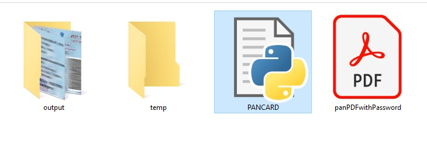
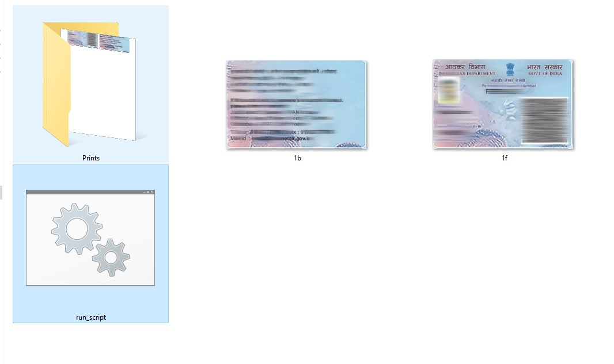

# 🪪 PAN Card Processor

---

## 📌 Overview
This script:
- Takes **PAN Card PDF**
- Extracts **Front & Back sides**
- Saves them as **high-quality JPGs**
- Moves processed files to `temp`

---

## 📂 Folder Structure
```
PAN/
│   PANCARD.py
│   panPDFwithPassword.pdf
│
├───output
│   │   1f.jpg
│   │   1b.jpg
│   │   run_script.bat
│   │
│   └───Prints
│       │   Printable_Batch_Page_1.jpg
│
└───temp
```

---

## 🖼️ Sample Output
  


---

## ⚙️ Requirements
```bash
pip install opencv-python numpy pdf2image
```

Install **Poppler** and set path:
```python
POPPLER_PATH = r"C:\path\to\poppler\bin"
```

---

## 🚀 How To Use
1. Place **PAN PDF** in folder  
2. Run:
```bash
python PANCARD.py
```
3. If password required:
   - Script auto tries filename as password  
   - Else asks manually  

4. Output:
   - `1f.jpg` → Front  
   - `1b.jpg` → Back  

5. Original PDF → moved to `temp`

---

## 🧠 Key Logic

### 🔐 Password Handling
- If filename is numeric → used as password  
- Else → asks user input  

---

### ✂️ Cropping Logic
```python
front_card = full_page[6084:7682, 331:2832]
back_card  = full_page[6108:7686, 2957:5446]
```
- Extracts precise PAN card regions

---

### 🔢 Auto Indexing
- Output naming:
```
1f.jpg, 1b.jpg
2f.jpg, 2b.jpg ...
```

---

## ⚡ Features
- ✔️ Auto password detection
- ✔️ Manual password fallback
- ✔️ Batch processing
- ✔️ Auto file indexing
- ✔️ Safe file movement
- ✔️ High-quality output (95%)
- ✔️ Loading animation (CLI)

---

## ⚠️ Limitations
- Works only for **specific PAN PDF format**
- Crop values are fixed
- Requires correct alignment

---

## 💡 Tip
If output is incorrect:
- Adjust crop values based on your PDF

---

## 🧾 Output Naming
- `1f.jpg` → Front  
- `1b.jpg` → Back  
- Next → `2f, 2b...`

---
