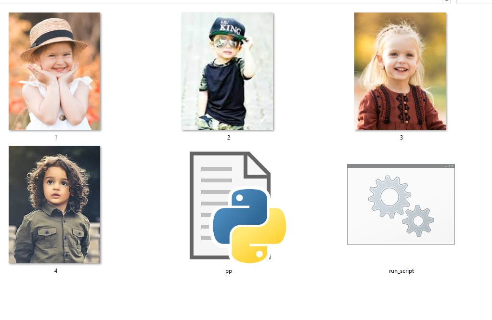
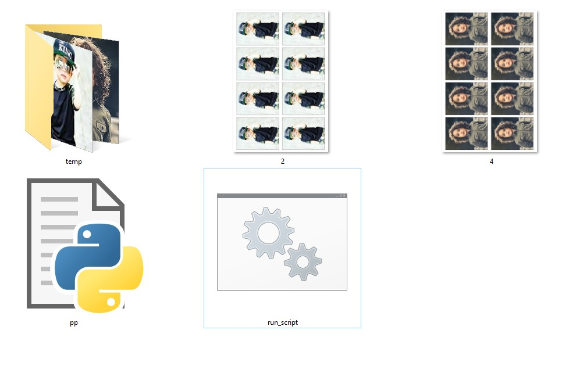

# 🪪 Passport Photo Sheet Maker

---

## 📌 Overview
This tool:
- Converts images into **passport-size photo sheets**
- Automatically arranges **8 photos (2x4 grid)**
- Adds **black border (stroke)**
- Outputs **4x6 printable sheet (700 DPI)**

---

## 📂 Folder Structure
```
Passphoto Maker/
│   pp.py
│   run_script.bat
│   2.jpg
│   4.jpg
│
└───temp
    (original images moved here)
```

---

## 🖼️ Sample Output
  


---

## ⚙️ Requirements
```bash
pip install pillow
```

---

## 🚀 How To Use

### 🔹 Method 1 (Python)
```bash
python pp.py
```

### 🔹 Method 2 (Recommended)
```bash
run_script.bat
```

> 💡 Use `.bat` if Python doesn’t run directly on your system

---

## 🧠 Key Logic

### 📏 Sheet Settings
- Size: **4x6 inch**
- DPI: **700**
- Resolution: `2800 x 4200`

---

### 🪪 Photo Size
- Each photo: **45mm x 35mm**
- Auto resized + rotated
- Converted to **landscape format**

---

### 🔲 Layout
- Grid: **2 columns × 4 rows**
- Total: **8 photos per sheet**
- Even spacing calculated automatically

---

### 🖤 Border
```python
ImageOps.expand(photo, border=3, fill='black')
```
- Adds **3px black stroke** around each photo

---

## ⚡ Features
- ✔️ Auto resize + rotate
- ✔️ Perfect print layout (4x6)
- ✔️ High quality output (98%)
- ✔️ Batch processing
- ✔️ Auto move originals → `temp`
- ✔️ Clean overwrite with same filename

---

## ⚠️ Limitations
- Works best with **portrait images**
- Incorrect aspect ratio may stretch image

---

## 💡 Tips
- Use clear front-facing photos
- Avoid low resolution images
- Keep background plain for best results

---

## 🧾 Output
- Final sheet saved as:
```
same_name.jpg
```
- Original image moved to:
```
temp/
```

---
