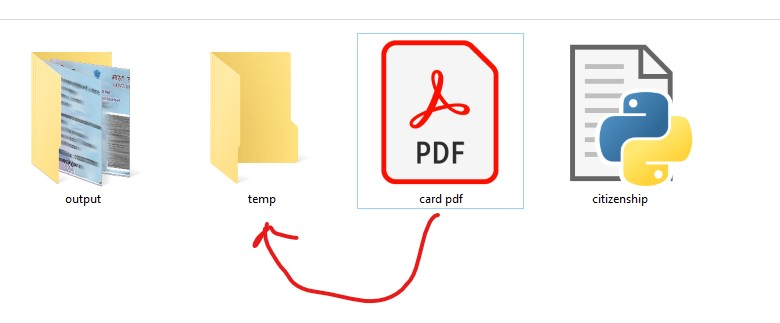

# 👴 Senior Citizenship Card Processor

> ⚠️ **Note:** Sample image used here is a **PAN card**, but the script is designed **only for Senior Citizenship Cards**.

---

## 📌 Overview
This script:
- Takes **Senior Citizenship PDF**
- Extracts **Front & Back sides**
- Saves them as **high-quality JPGs**
- Moves processed files to `temp`

---

## 📂 Folder Structure
```
SENIOR CITIZENSHIP/
│   citizenship.py
│   card pdf.pdf
│
├───output
│   │   1f.jpg
│   │   1b.jpg
│
└───temp
```

---

## 🖼️ Sample Output


---

## ⚙️ Requirements
```bash
pip install opencv-python numpy pdf2image
```

Install **Poppler** and set path:
```python
POPPLER_PATH = r"C:\path\to\poppler\bin"
```

---

## 🚀 How To Use
1. Place **PDF file** in folder  
2. Run:
```bash
python citizenship.py
```
3. Output:
   - `1f.jpg` → Front  
   - `1b.jpg` → Back  
4. Original PDF → moved to `temp`

---

## 🧠 Key Logic
- Reads **PDF only**
- Uses **auto password detection**
  - tries filename as password
  - asks user if needed
- Crops using scaled coordinates:
```python
SCALE = TARGET_DPI / ORIGINAL_DPI

F_X, F_Y = int(1692 * SCALE), int(1123 * SCALE)
F_W, F_H = int(2328 * SCALE), int(1465 * SCALE)

B_X, B_Y = int(1696 * SCALE), int(3066 * SCALE)
B_W, B_H = int(2328 * SCALE), int(1465 * SCALE)
```

---

## ⚡ Features
- ✔️ Auto password handling
- ✔️ Batch processing
- ✔️ Auto file indexing (`1f, 2f...`)
- ✔️ High-quality output (98%)
- ✔️ Loading animation (CLI spinner)
- ✔️ Memory cleanup (GC used)

---

## ⚠️ Limitations
- Works only for **specific card layout**
- Requires correct **PDF alignment**
- Hardcoded crop values

---

## 💡 Tip
If crop is wrong:
- Adjust coordinates in code based on your PDF

---

## 🧾 Output Naming
- `1f.jpg` → Front  
- `1b.jpg` → Back  
- Next files → `2f, 2b...`

---
