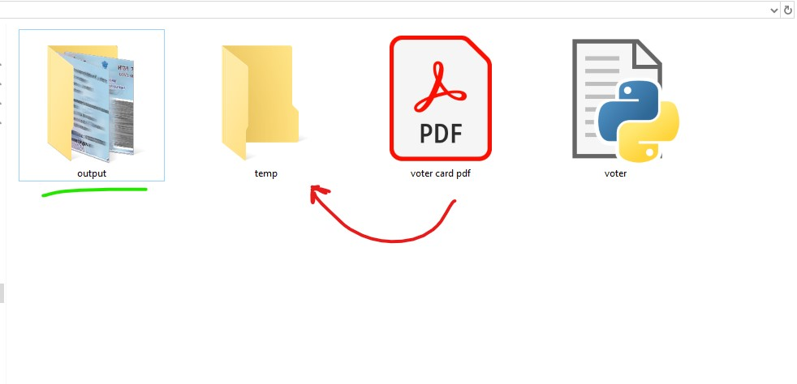

# 🗳️ Voter Card Processor

> ⚠️ **Note:** Sample image used here is a **PAN card**, but the script is designed **only for Voter Cards**.

---

## 📌 Overview
This script automatically:
- Takes **Voter Card PDF or Image**
- Extracts **Front & Back sides**
- Saves them as **high-quality JPGs**
- Moves original files to `temp` folder

---

## 📂 Folder Structure
```
VOTER/
│   voter.py
│   voter card pdf.pdf
│
├───output
│   │   1f.jpg
│   │   1b.jpg
│
└───temp
```

---

## 🖼️ Sample Output


---

## ⚙️ Requirements
Install dependencies:
```bash
pip install opencv-python numpy pdf2image
```

Also install **Poppler** and update path:
```python
POPPLER_PATH = r"C:\path\to\poppler\bin"
```

---

## 🚀 How It Works
1. Place your **Voter Card PDF/Image** in the folder
2. Run:
```bash
python voter.py
```
3. Output:
   - `1f.jpg` → Front side  
   - `1b.jpg` → Back side  
4. Original file → moved to `temp`

---

## 🧠 Key Logic
- Detects all PDF/Image files automatically
- Converts PDF → Image (700 DPI)
- Crops using fixed coordinates:
```python
front_card = full_page[925:2415, 320:2690]
back_card  = full_page[925:2420, 3178:5555]
```
- Maintains **auto-increment file naming** (`1f, 2f, 3f...`)

---

## 📌 Features
- ✔️ Batch processing
- ✔️ Auto file indexing
- ✔️ Safe file moving (no overwrite)
- ✔️ High-quality output (95%)

---

## ⚠️ Limitations
- Works only for **specific Voter Card layout**
- Cropping is **hardcoded** (may fail for different formats)

---

## 💡 Tip
If output is wrong:
- Adjust crop values in code based on your PDF/image

---
